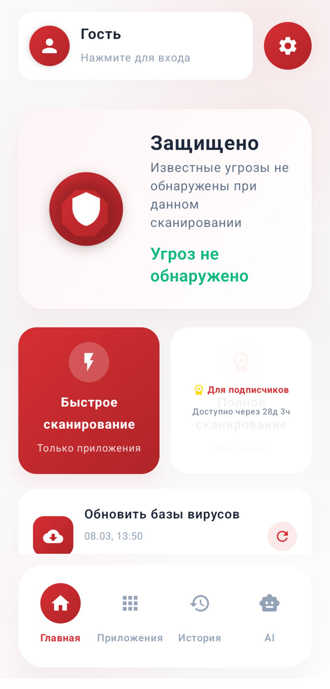
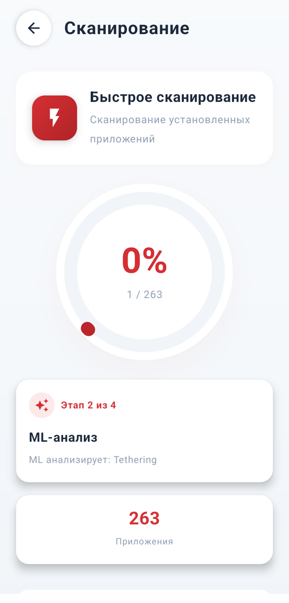
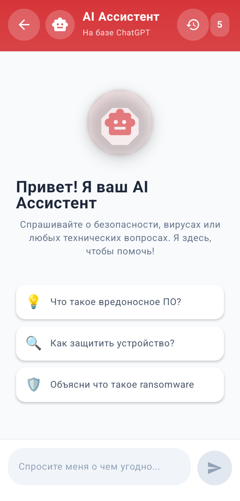
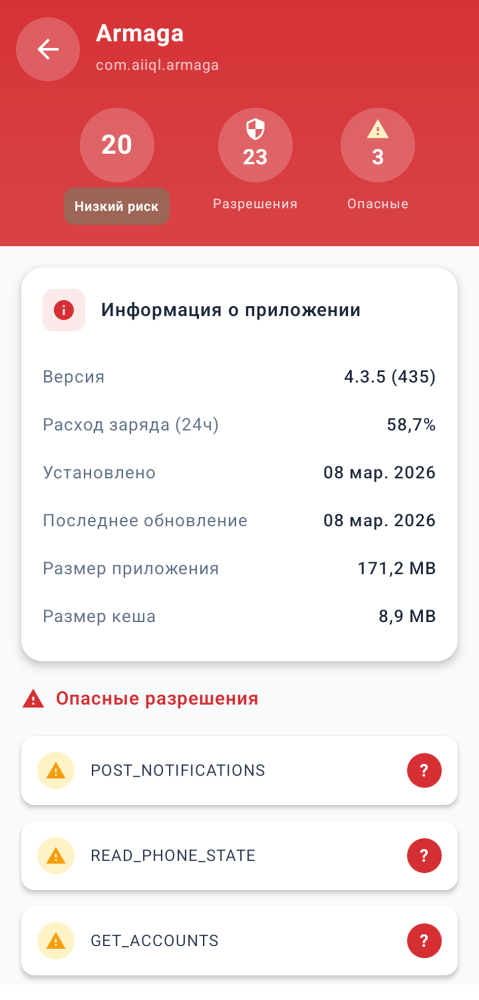
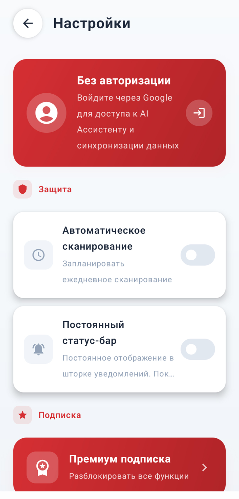

<div align="center">

<!-- HERO BANNER -->


<br/>

<!-- BADGES ROW 1 -->

[](https://play.google.com/store/apps/details?id=com.aiiql.armaga)
[](https://play.google.com/store/apps/details?id=com.aiiql.armaga)
[](https://github.com/T1desLuck/Armaga)

<!-- BADGES ROW 2 -->

[](https://play.google.com/store/apps/details?id=com.aiiql.armaga)
[](https://openai.com)
[](https://colab.research.google.com/github/T1desLuck/Armaga/blob/master/MalwareBazaar.ipynb)
[](https://t1desluck.github.io/Armaga/home.html)
[](https://colab.research.google.com/github/T1desLuck/Armaga/blob/master/MalwareBazaar.ipynb)
[](https://github.com/T1desLuck/Armaga)
[](https://github.com/T1desLuck)

<br/>

# ██  ARMAGA: ANTIVIRUS & SECURITY  ██

### *Многослойное обнаружение угроз. Local-first. Усиленный ИИ. Нулевая утечка данных.*

<br/>

-----

</div>

## 📽️ Промо-ролик

<div align="center">

[](https://youtu.be/QPEG5rdXjjc?si=XAfrFUDaYR0Dh8ZW)

> *Нажмите на превью, чтобы посмотреть полный промо-ролик на YouTube*

</div>

-----

## 📸 Скриншоты

<div align="center">

|                                    |                                    |                                    |                                    |                                    |
|:----------------------------------:|:----------------------------------:|:----------------------------------:|:----------------------------------:|:----------------------------------:|
||||||
|*Главный экран*                     |*Сканирование*                      |*AI Ассистент*                      |*Анализ приложений*                 |*Настройки*                         |

</div>

-----

## ⚡ Что такое Armaga?

**Armaga: Antivirus & Security** — профессиональный антивирусный комплекс для Android, построенный с нуля на принципе **приоритета локальной обработки данных**. В отличие от облачно-зависимых антивирусных решений, Armaga выполняет подавляющее большинство анализа непосредственно на устройстве — ваши файлы, данные приложений и поведенческая телеметрия **никогда не покидают телефон**.

Движок объединяет **четыре независимых уровня обнаружения**: криптографическое сопоставление сигнатур, эвристический анализ разрешений, локальная модель машинного обучения и фоновый мониторинг в реальном времени — все они работают одновременно, чтобы поймать известные угрозы, атаки нулевого дня, рекламное и шпионское ПО до того, как они нанесут вред.

Поверх движка безопасности — интегрированный **AI Ассистент** (на базе OpenAI GPT через официальный API), который помогает пользователям понять результаты сканирований, управлять защитой устройства и выполнять команды движка через естественный диалог — при полной изоляции от личных файлов.

> 🔴 **Красно-белый. Острый. Беспощадный к малварям.**

-----

## 🏗️ Архитектура системы

```
┌─────────────────────────────────────────────────────────────────────┐
│                      ARMAGA SECURITY ENGINE                         │
│                                                                     │
│  ┌──────────────┐  ┌──────────────┐  ┌──────────────┐  ┌────────┐   │
│  │  УРОВЕНЬ 1   │  │  УРОВЕНЬ 2   │  │  УРОВЕНЬ 3   │  │УРОВЕНЬ │   │
│  │  Сигнатурный │  │  Эвристика   │  │  ML / Нейрон-│  │   4    │   │
│  │  анализ      │  │              │  │  ная сеть    │  │Реальное│   │
│  │  (SHA-256)   │  │  Анализ      │  │              │  │время   │   │
│  │              │  │  разрешений  │  │  Zero-Day    │  │        │   │
│  │  Хеш файла   │  │  и паттернов │  │  Spyware     │  │Adware  │   │
│  │  vs локальная│  │  поведения   │  │  Adware      │  │детект. │   │
│  │  БД сигнатур │  │              │  │  Локальный   │  │Тихий   │   │
│  │              │  │  Оценка риска│  │  инференс    │  │режим   │   │
│  └──────┬───────┘  └──────┬───────┘  └──────┬───────┘  └───┬────┘   │
│         └─────────────────┴─────────────────┴──────────────┘        │
│                                     │                               │
│                          ┌──────────▼──────────┐                    │
│                          │  СВОДНЫЙ РЕЗУЛЬТАТ  │                    │
│                          │  + ОТЧЁТ ПО РИСКАМ  │                    │
│                          └─────────────────────┘                    │
│                                                                     │
│  ┌──────────────────────────────────────────────────────────────┐   │
│  │  AI АССИСТЕНТ  (OpenAI GPT API — только текстовые запросы)   │   │
│  │  Изолирован от файловой системы │ Личные данные не передаются│   │
│  └──────────────────────────────────────────────────────────────┘   │
│                                                                     │
│  Данные категории B (файлы, хеши, метаданные, история сканирований) │
│  остаются на устройстве. У разработчика нет технического доступа.   │
└─────────────────────────────────────────────────────────────────────┘
```

-----

## 🔍 Типы сканирований

### 🔵 Быстрое сканирование — *только приложения*

Быстрое и точечное. Анализирует все установленные и предустановленные приложения без обращения к файловой системе.

|Метод обнаружения                   |Цель                                                      |
|------------------------------------|----------------------------------------------------------|
|Эвристический анализ                |Злоупотребление разрешениями, опасные комбинации прав     |
|Инференс ML-модели                  |Поведенческие сигнатуры Spyware и Adware                  |
|Детекция оверлеев в реальном времени|Активные фишинговые оверлеи, агрессивные инжекторы рекламы|

### 🔴 Полное сканирование — *приложения + файловая система + галерея*

Полное покрытие устройства. Включает всё из быстрого сканирования плюс:

|Метод обнаружения          |Цель                                                        |
|---------------------------|------------------------------------------------------------|
|**Сигнатурный анализ**     |Файлы любых форматов — APK, документы, архивы, медиа        |
|Глубокое сканирование      |Структурный анализ APK, паттерны обфускации                 |
|Эвристический анализ       |Избыточность разрешений относительно заявленного функционала|
|Инференс ML-модели         |Zero-Day угрозы, неизвестный Spyware и Adware               |
|Галерея и внешнее хранилище|Вредоносные APK в Downloads, на SD-карте и т.д.             |

-----

## 🧠 Движок обнаружения — технические детали

### Уровень 1 — Сигнатурный анализ

- Вычисляет криптографические хеши (MD5, SHA-1, SHA-256 и другие алгоритмы) файлов на устройстве
- Сравнивает с **локальной базой сигнатур**, построенной на основе [MalwareBazaar](https://bazaar.abuse.ch/) и вручную проверенной разработчиком
- База хранится в виде структурированных `.txt` файлов в папке [`databases/`](databases/) этого репозитория
- Автообновление по HTTPS прямо из этого репозитория GitHub — без сторонних CDN
- **Работает офлайн:** полное сигнатурное сканирование не требует интернета
- Хеш-функция — односторонняя: восстановить оригинальный файл из хеша технически невозможно

### Уровень 2 — Эвристический анализ

- Анализирует **количество и типы разрешений**, запрашиваемых каждым приложением
- Оценивает приложения по рисковым моделям, построенным на паттернах разрешений известных малваров
- Обнаруживает комбинации разрешений, характерные для **шпионского ПО и adware**
- Флагует приложения, где разрешения значительно превышают заявленный функционал
- Контент файлов не читается — анализ работает только с метаданными

### Уровень 3 — ML-модель (локальная нейронная сеть)

- Обученная модель машинного обучения встроена непосредственно в APK приложения
- Работает полностью **на устройстве** — данные для инференса не передаются никуда
- Обучена разработчиком самостоятельно на публично доступных наборах данных
- Нацелена на угрозы вне покрытия сигнатур: **Zero-Day малвары, Spyware, Adware**
- Архитектура, количество и веса моделей могут обновляться без предварительного уведомления

### Уровень 4 — Фоновый мониторинг в реальном времени

- Непрерывный тихий мониторинг 24/7 для обнаружения **живых событий инжекции Adware**
- Сопоставляет активность на переднем плане с агрессивными оверлей-событиями для идентификации источника
- Использует `BIND_ACCESSIBILITY_SERVICE` и `PACKAGE_USAGE_STATS` исключительно для обнаружения угроз
- Нулевой перехват нажатий клавиш, нулевая запись экрана, нулевая эксфильтрация данных
- Можно отключить в любой момент в настройках приложения; отключение не влияет на ручное сканирование

-----

## 🗄️ Конвейер базы сигнатур

Этот репозиторий содержит живую базу сигнатур, используемую Armaga для офлайн-сканирования. Конвейер её создания и поддержки:

```
MalwareBazaar API
       │
       ▼
  Загрузка сырых датасетов хешей
       │
       ▼
  Ручная проверка и верификация на ПК
  (фильтрация ложных срабатываний,
   дедупликация, проверка актуальности)
       │
       ▼
  ┌─────────────────────────────────────────┐
  │  Обработка в Google Colab Notebook      │
  │  → Нормализация                         │
  │  → Валидация формата                    │
  │  → Извлечение SHA-256 и дедупликация    │
  │  → Финальный экспорт в .txt             │
  └─────────────────────────────────────────┘
       │
       ▼
  Коммит в папку /databases/
  в репозитории T1desLuck/Armaga
       │
       ▼
  Приложение автоматически скачивает дельту
  по HTTPS в цикле обновлений
  (< 200 КБ на типичное обновление)
       │
       ▼
  Локальная БД сигнатур обновлена на устройстве
  ✅ Офлайн-сканирование готово
```

> 🔬 **Открой Colab-ноутбук** для работы с конвейером обработки сигнатур:
> 
> [](https://colab.research.google.com/github/T1desLuck/Armaga/blob/master/MalwareBazaar.ipynb)

-----

## 🤖 AI Ассистент

Встроенный AI Ассистент работает на базе **OpenAI GPT** через официальный API и выполняет роль консультанта по безопасности прямо внутри приложения. Текущая модель — **ChatGPT (OpenAI, LLC, США)**. Разработчик вправе сменить языковую модель при условии, что это не повлечёт расширения передаваемых персональных данных.

### Что умеет AI Ассистент

- Отвечать на вопросы о кибербезопасности, защите устройства и работе Armaga
- Выполнять команды приложения через естественный язык: *«Запусти полное сканирование»*, *«Обнови базы сигнатур»*, *«Покажи опасные приложения»*
- Объяснять результаты сканирований и категории угроз
- Помогать с управлением разрешениями и настройкой защиты устройства
- Знакомить пользователя с его устройством и установленными приложениями в безопасном контексте

### Что AI Ассистент **никогда не получает** — по архитектуре

```
AI Ассистент получает:
  ✅ Текст запроса пользователя
  ✅ Анонимизированные агрегированные ответы команд
     (например: «угрозы не обнаружены», «базы обновлены»)
  ✅ Метаданные версии приложения и временная метка

AI Ассистент НИКОГДА не получает:
  ❌ Имена или пути файлов
  ❌ Содержимое файлов
  ❌ Фото, контакты, SMS и переписку
  ❌ Пароли, PIN-коды и учётные данные
  ❌ Любые другие персональные данные пользователя
```

- Доступен только **аутентифицированным пользователям** (вход через Google)
- Бесплатный уровень включает ограниченное количество запросов
- Лимит снимается при наличии активной **подписки**
- AI Ассистент не имеет прямого доступа к системным API устройства — все действия выполняются только по явному запросу и подтверждению пользователя

-----

## 🔐 Архитектура приватности

Armaga построен на фундаменте **Privacy by Design** и **Privacy by Default**. Модель данных разделена на две принципиально разные категории:

|                       |Категория A — Внешняя                  |Категория B — Только локально            |
|-----------------------|---------------------------------------|-----------------------------------------|
|**Что**                |Адрес email (только авторизация)       |Всё остальное                            |
|**Где хранится**       |Google Firebase / Cloud Platform       |Sandbox на устройстве                    |
|**Кто имеет доступ**   |Разработчик через инфраструктуру Google|Только пользователь                      |
|**Передаётся?**        |Только через сервисы Google            |**Никогда, ни при каких обстоятельствах**|
|**Доступ разработчика**|Только email                           |**Нулевой технический доступ**           |


> Разработчик **никогда не продаёт** персональные данные пользователей третьим лицам. Данные о сканированиях, файлах, установленных приложениях и поведении пользователя не передаются никому — включая цели аналитики или улучшения приложения. Разработка приложения ведётся самостоятельно с использованием публично доступных данных.

### Потоки данных к третьим сторонам

|Партнёр       |Данные                                    |Назначение                          |Политика                                                                                          |
|--------------|------------------------------------------|------------------------------------|--------------------------------------------------------------------------------------------------|
|Google LLC    |Email, Advertising ID (GAID)              |Авторизация, подписки, реклама AdMob|[Ссылка](https://policies.google.com/privacy)                                                     |
|OpenAI, L.L.C.|Текстовые запросы к AI Ассистенту         |Генерация ответов AI Ассистента     |[Ссылка](https://openai.com/privacy)                                                              |
|GitHub, Inc.  |IP-адрес, временная метка (серверные логи)|Доставка обновлений базы сигнатур   |[Ссылка](https://docs.github.com/en/site-policy/privacy-policies/github-general-privacy-statement)|


> 📜 Полная политика конфиденциальности: [t1desluck.github.io/Armaga/home.html](https://t1desluck.github.io/Armaga/home.html)

-----

## 📱 Полный список функций

<table>
<tr><td width="50%">

**🛡️ Движок безопасности**

- ✅ Быстрое сканирование (только приложения)
- ✅ Полное сканирование (приложения + файловая система + галерея)
- ✅ Глубокий структурный анализ APK
- ✅ Эвристический анализ разрешений
- ✅ Локальная ML-модель (Zero-Day, Spyware, Adware)
- ✅ Сигнатурное сканирование (SHA-256, MalwareBazaar)
- ✅ Фоновый мониторинг 24/7 (тихий режим)
- ✅ Обнаружение оверлеев Adware в реальном времени

</td><td width="50%">

**⚙️ Управление и UX**

- ✅ Полный список приложений с оценкой рисков
- ✅ Управление белым списком приложений
- ✅ История сканирований
- ✅ Экспорт статистики (на всех языках приложения)
- ✅ Запланированное автоматическое сканирование
- ✅ Постоянный статус-бар с индикатором эвристики
- ✅ Гибкие настройки уведомлений
- ✅ Выбор размера шрифта и языка интерфейса

</td></tr>
<tr><td>

**🌐 Локализация и доступность**

- ✅ Более 10 языков интерфейса
- ✅ Полная локализация включая экспорт статистики
- ✅ Адаптивный интерфейс

</td><td>

**🤖 Интеллект и аккаунт**

- ✅ AI Ассистент (OpenAI GPT)
- ✅ Управление командами через естественный язык
- ✅ Авторизация через Google Sign-In
- ✅ Подписка через Google Play Billing
- ✅ Автообновление базы сигнатур из этого репозитория

</td></tr>
</table>

-----

## 🔑 Разрешения Android

|Разрешение                  |Уровень риска|Назначение                                                                  |
|----------------------------|-------------|----------------------------------------------------------------------------|
|`MANAGE_EXTERNAL_STORAGE`   |⚠️ Высокий  |Сканирование SD-карты, Downloads, Documents на наличие вредоносных APK       |
|`QUERY_ALL_PACKAGES`        |Средний      |Полный список установленных приложений для аудита безопасности (Android 11+)|
|`BIND_ACCESSIBILITY_SERVICE`|⚠️ Высокий  |Обнаружение фишинговых оверлеев и агрессивной рекламы в реальном времени     |
|`SYSTEM_ALERT_WINDOW`       |Средний      |Отображение критических предупреждений об угрозах поверх других окон        |
|`PACKAGE_USAGE_STATS`       |Средний      |Определение источника агрессивной инжекции рекламы Adware                   |
|`REQUEST_DELETE_PACKAGES`   |Низкий       |Запуск стандартного диалога Android для удаления обнаруженной угрозы        |
|`INTERNET`                  |—            |Обновления базы сигнатур, AI Ассистент, авторизация                         |


> Все разрешения **функционально обоснованы и минимизированы**. Отказ от любого разрешения сохраняет базовую работоспособность приложения, но ограничивает глубину защиты. Разрешения никогда не используются для сбора данных или слежки. Использование Accessibility API полностью соответствует требованиям политики Google Play и служит исключительно целям безопасности устройства.

-----

## 🏪 Скачать

<div align="center">

[](https://play.google.com/store/apps/details?id=com.aiiql.armaga)

**Package ID:** `com.aiiql.armaga`

</div>

-----

## 📂 Структура репозитория

```
T1desLuck/Armaga/
│
├── databases/                  # Базы хешей сигнатур (SHA-256)
│   └── *.txt                   # Автозагружаются приложением при обновлении
│
├── image/                      # Скриншоты для README
│   ├── 1.jpg
│   ├── 2.jpg
│   ├── 3.jpg
│   ├── 4.jpg
│   └── 5.jpg
│
├── MalwareBazaar.ipynb         # Google Colab: конвейер обработки базы сигнатур
│
└── README.md                   # Этот файл
```

-----

## 🛠️ База сигнатур — обновление и работа

База сигнатур в `databases/` — основной источник для офлайн-сканирования Armaga. Рабочий процесс:

1. **Источник:** [MalwareBazaar](https://bazaar.abuse.ch/) — сообщественный репозиторий хешей малваров
1. **Обработка:** Открыть [`MalwareBazaar.ipynb`](MalwareBazaar.ipynb) в Google Colab — ноутбук выполняет нормализацию, дедупликацию и извлечение SHA-256
1. **Проверка:** Каждая партия вручную перепроверяется перед мёржем для минимизации ложных срабатываний
1. **Деплой:** Закоммитить обновлённые `.txt` файлы в `databases/` — приложение автоматически скачает дельту
1. **Поведение приложения:** Armaga загружает только изменённые строки, трафик минимален (обычно < 200 КБ)

[](https://colab.research.google.com/github/T1desLuck/Armaga/blob/master/MalwareBazaar.ipynb)

-----

## 👤 Автор

<div align="center">

**TIDESLUCK**

[](https://github.com/T1desLuck)
[](mailto:tidesluck@icloud.com)

*ИП Барков Никита Сергеевич*
*Республика Казахстан, 110000, г. Костанай, ул. Ш. Шаяхметова, 165*

</div>

-----

## ⚖️ Правовая информация

|                               |                                                                                                                                                   |
|-------------------------------|---------------------------------------------------------------------------------------------------------------------------------------------------|
|**Разработчик**                |ИП Барков Никита Сергеевич                                                                                                                         |
|**Страна**                     |Республика Казахстан                                                                                                                               |
|**Адрес**                      |110000, Костанай, ул. Ш. Шаяхметова, 165                                                                                                           |
|**Применимое право**           |Законодательство РК; GDPR (для пользователей ЕЭЗ)                                                                                                  |
|**Правовые основания**         |Закон РК от 21.05.2013 № 94-V «О персональных данных и их защите»; Закон РК от 24.11.2015 № 418-V «Об информатизации»; Регламент ЕС 2016/679 (GDPR)|
|**Контакт**                    |tidesluck@icloud.com                                                                                                                               |
|**Политика конфиденциальности**|[t1desluck.github.io/Armaga/home.html](https://t1desluck.github.io/Armaga/home.html)                                                               |
|**Версия документа**           |1.0.433, от 07.03.2026                                                                                                                             |

### Права пользователей

В соответствии с применимым законодательством пользователь имеет право:

- **Доступ** — запросить информацию о составе обрабатываемых данных
- **Исправление** — запросить корректировку неточных данных
- **Удаление** — в любой момент удалить аккаунт и связанный email через настройки приложения
- **Отзыв согласия** — отозвать согласие на обработку персональных данных
- **Управление разрешениями** — изменить разрешения Android через «Настройки → Приложения → Armaga → Разрешения»
- **Управление рекламой** — ограничить персонализацию AdMob через «Настройки → Google → Реклама»
- **Жалоба** — обратиться в уполномоченный орган по защите персональных данных РК или (для резидентов ЕЭЗ) в соответствующий надзорный орган

> Для реализации прав — направить запрос на: **tidesluck@icloud.com** с указанием email аккаунта Armaga и конкретного права, которое вы хотите реализовать.

-----

## 🚨 Отказ от ответственности

Armaga обеспечивает многоуровневое обнаружение угроз, но **не гарантирует 100% обнаружение всех видов вредоносного ПО**. Угрозы постоянно эволюционируют и ни одно решение в области кибербезопасности не является абсолютным. Armaga **дополняет** — а не заменяет — встроенные механизмы безопасности Android (включая Google Play Protect). Окончательное решение по любой обнаруженной угрозе всегда остаётся за пользователем.

-----

<div align="center">

```
██████████████████████████████████████████████████
█                                                █
█         ARMAGA: ANTIVIRUS & SECURITY           █
█         Local-First. AI-Enhanced.              █
█         Построен для реальных угроз.           █
█                                                █
█              by TIDESLUCK                      █
██████████████████████████████████████████████████
```

**© 2026 ИП Барков Никита Сергеевич — Все права защищены**

[Google Play](https://play.google.com/store/apps/details?id=com.aiiql.armaga) · [Политика конфиденциальности](https://t1desluck.github.io/Armaga/home.html) · [GitHub](https://github.com/T1desLuck/Armaga) · [Colab Notebook](https://colab.research.google.com/github/T1desLuck/Armaga/blob/master/MalwareBazaar.ipynb) · [YouTube Промо](https://youtu.be/QPEG5rdXjjc?si=XAfrFUDaYR0Dh8ZW)

</div>
